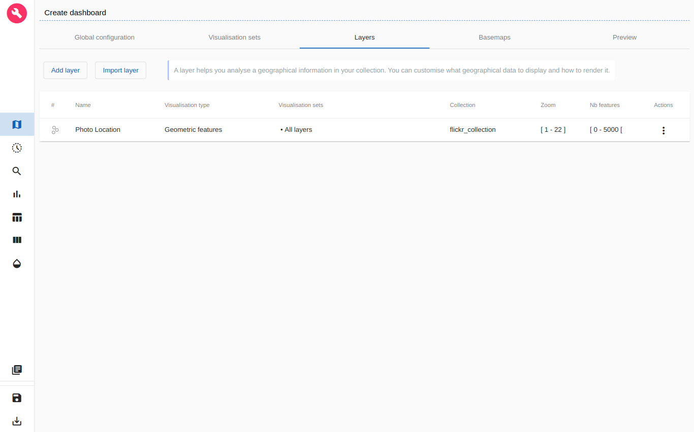
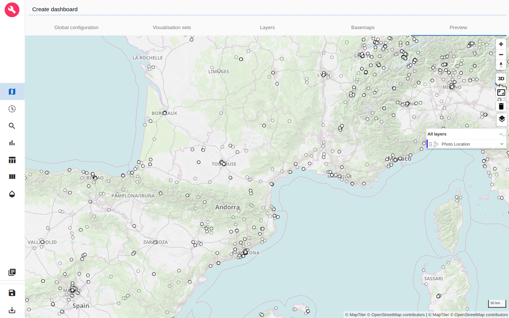
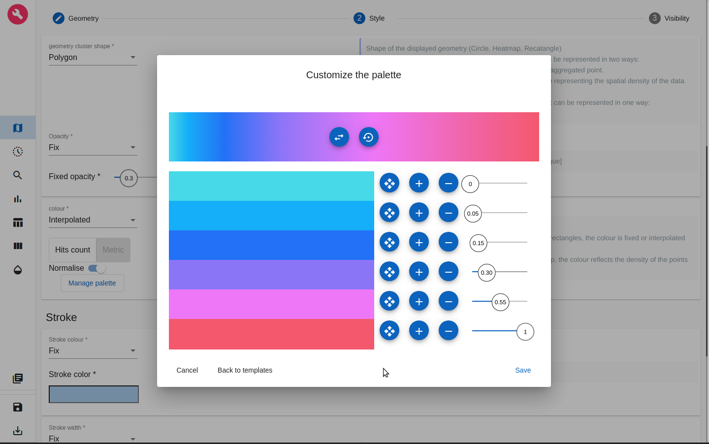
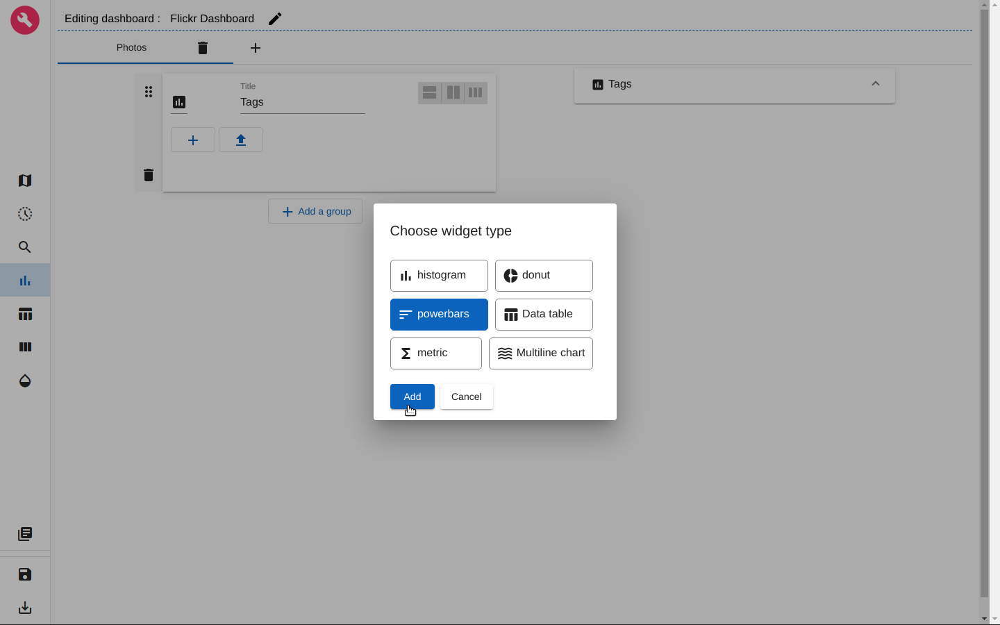

# ARLAS-stack-flickr-tutorial

## About this tutorial
### What will you learn?
With this tutorial, you'll be able to:

- Start an ARLAS-Exploration stack
- Index some Flickr photo metadata in Elasticsearch
- Reference the indexed Flickr photo data in ARLAS
- Create a view of ARLAS-wui (a dashboard) to explore the Flickr photo data using ARLAS-wui-hub and ARLAS-wui-builder

### What will you need?

You will need :

- docker & docker-compose
- curl

### What will you get?

<p align="center">
    
</p>
<p align="center" style="font-style: italic;">
Exploration app created in this tutorial
</p>

## Flickr photo data

Let's explore some photo data, available on __[Flickr](https://www.flickr.com/)__.

We built a dataset composed of Flickr metadata for photos from the month of January 2020 thanks to the [Flickr API](https://www.flickr.com/services/api/)

This subset is stored in `flickr_data.json`. It contains around 50.000 geo located Flickr photos described with at least 9 main columns:

- photo_id: Unique identifier of the photo
- datetaken: Date of the photo
- ownername: Name of the Flickr user who published the photo
- owner: Code of the Flickr user who published the photo
- timestamp: Unix timestamp corresponding to the date of the photo
- point_geom: WKT geometry of the location associated to the photo
- tags: Tags associated to the phot by the owner
- server: Server of the image
- secret: Identifier used to access image on Flicker server

The content of a line of the json file looks like:

|photo_id|datetaken|ownername|owner|timestamp|point_geom|tags| server | secret |
|---|---|---|---|---|---|---|--------|--------|
|51684435389|2020-01-10 12:21:15|jeffergray|27685985@N03|1578655275|"POINT(-89.810623 18.105227)"|"2020","winter"|65535|1167660620|

*Some other fields are contained in the data but will not be explored in this tutorial, feel free to explore them.*

## Exploring Flickr data

We will explore this data using ARLAS.

__0. Setup__

- Create a repository dedicated to this tutorial

```shell
mkdir ARLAS-stack-flickr-tutorial
cd ARLAS-stack-flickr-tutorial

```

- Download the flickr data

```shell
curl -o flickr_data.json -L "https://raw.githubusercontent.com/gisaia/ARLAS-stack-photo-flickr-tutorial/master/data/flickr_data.json"

```

Check that `flickr_data.json` file is downloaded

```shell
ls -l flickr_data.json

```

- Download the ARLAS-Exploration-stack project and unzip it

```shell
(curl -L -O "https://github.com/gisaia/ARLAS-Exploration-stack/archive/develop.zip"; unzip develop.zip)

```

Check that the `ARLAS-Exploration-stack-develop` stack is downloaded

```shell
ls -l ARLAS-Exploration-stack-develop

```

Now our tutorial environment is set up.

__1. Starting ARLAS Exploration Stack__

```shell
./ARLAS-Exploration-stack-develop/start.sh

```

__2. Indexing flickr data in Elasticsearch__

- Create `flickr_index` index in Elasticsearch with `flickr.es_mapping.json` mapping file

```shell
curl "https://raw.githubusercontent.com/gisaia/ARLAS-stack-photo-flickr-tutorial/master/configs/flickr.es_mapping.json" |
curl -XPUT http://localhost:9200/flickr_index/?pretty \
    -d @- \
    -H 'Content-Type: application/json'

```

You can check that the index is successfuly created by running the following command

```shell
curl -XGET http://localhost:9200/flickr_index/_mapping?pretty

```

- Index data that is in `flickr_data.json` in Elasticsearch. For that, we need Logstash as a data processing pipeline that ingests data in Elasticsearch. Logstash needs a configuration file (`flickr2es.logstash.conf`) that indicates how to transform data from the CSV file and to index it in Elasticsearch.


```shell
curl "https://raw.githubusercontent.com/gisaia/ARLAS-stack-photo-flickr-tutorial/master/configs/flickr2es.logstash.conf" \
    -o flickr2es.logstash.conf
    
```

- Now we will use Logstash in order to apply the data model transformation and to index data in Elasticsearch given the `flickr2es.logstash.conf` configuration file with the docker image `docker.elastic.co/logstash/logstash` :

```shell
network=$(docker network ls --format "table {{.Name}}" | grep arlas)

cat flickr_data.json | docker run -e XPACK_MONITORING_ENABLED=false \
    --net ${network} \
    --env ELASTICSEARCH=elasticsearch:9200  \
    --env INDEXNAME=flickr_index --rm -i \
    -v ${PWD}/flickr2es.logstash.conf:/usr/share/logstash/pipeline/logstash.conf docker.elastic.co/logstash/logstash:7.11.2

```

- Check if __50 000__ photo locations are indexed:

```shell
curl -XGET http://localhost:9200/flickr_index/_count?pretty

```

__3. Declaring `flickr_index` in ARLAS__

ARLAS-server interfaces with data indexed in Elasticsearch via a collection reference.

The collection references an identifier, a timestamp, and geographical fields which allows ARLAS-server to perform a spatial-temporal data analysis


- Create a Flickr collection in ARLAS

```shell
curl "https://raw.githubusercontent.com/gisaia/ARLAS-stack-photo-flickr-tutorial/master/configs/flickr_collection.json" | \
curl -X PUT \
    --header 'Content-Type: application/json;charset=utf-8' \
    --header 'Accept: application/json' \
    "http://localhost:81/server/collections/flickr_collection?pretty=true" \
    --data @-

```

- Check that the collection is created using the ARLAS-server `collections/{collection}`

```shell
curl -X GET "http://localhost:81/server/collections/flickr_collection?pretty=true"

```

__4. Create a dashboard to explore `flickr data` with ARLAS__

ARLAS stack is up and running, we have flickr data available for exploration. We can now create our first dashboard composed of
- a map to observe the photo locations, the positions' geographical distribution
- a timeline presenting the number of photos taken over time
- a search bar to look for photos by their names for instance
- some widgets to analyse the data from another axis such as the tags or owner.

To do so, let's go to ARLAS-wui-hub at http://localhost:81/hub and create a new dashboard named `Flickr dashboard`.

<p align="center">
    
</p>
<p align="center" style="font-style: italic;">
figure 0: Creation of a dashboard in ARLAS-wui-hub
</p>

After clicking on __Create__, you are automatically redirected to ARLAS-wui-builder to start configuring your dashboard.

### Choosing the collection

The first thing we need to do is to tell ARLAS which collection of data we want to use to create our dashboard.

<p align="center">
    
</p>
<p align="center" style="font-style: italic;">
figure 1: Choose collection
</p>

In our case we choose the `flickr_collection`.

### Map configuration

As a first step, we set the map at zoom level 4 and the map's center coordinates at Latitude=44° and Longitude=4°. This way, when loading the dashboard in ARLAS-wui, the map will be located over Western Europe.

<p align="center">
    
</p>
<p align="center" style="font-style: italic;">
figure 2: Map initialisation
</p>

For now, the map is empty. __The first thing we want to find out is where the photos are taken.__

<p align="center">
    
</p>
<p align="center" style="font-style: italic;">
figure 3: Layers view
</p>

To do so, let's add a layer named `Photo location` to visualise the location associated to each photo on the map.

In the `Geometry` section ($1^{st}$ section), choose _point_geom_ as the features geo-field.

<p align="center">
    
</p>
<p align="center" style="font-style: italic;">
figure 4: Adding a <b>Geometric Features</b> layer named 'Photo location'
</p>

Now, let's define the layer's style. As a starter, we choose the best representation of our geometries: a photograph's location is a point. We choose a **circle** with a fixed color (white for instance) and a fixed width of 4 pixels. We choose a black stroke with a 1 pixel width. We set the transparency at 0.5 to better observe location overlapping. 

<p align="center">
    
</p>
<p align="center" style="font-style: italic;">
figure 5: Customizing 'Photo location' style: white circle
</p>

<p align="center">
    
</p>
<p align="center" style="font-style: italic;">
figure 6: Customizing 'Photo location' style: black stroke
</p>


After clicking on __Validate__, our first layer is created.

<p align="center">
    
</p>
<p align="center" style="font-style: italic;">
figure 7: New layer 'Photo location' is created
</p>

We can also choose the basemaps that will be available in the dashboard.

<p align="center">
    
</p>
<p align="center" style="font-style: italic;">
figure 8: Choice of Basemaps
</p>

We can go and preview the layer in `Preview` tab.

<p align="center">
    
</p>
<p align="center" style="font-style: italic;">
figure 9: Preview of 'Photo location' layer
</p>

We can now see where the photos are taken thanks to this layer.


### Timeline configuration

Let's find out the time period when these positions were emitted.

For that, let's define a timeline: a histogram that will represent the number of pictures taken over time.

For the x-Axis we choose the `timestamp` field. The y-Axis represents the number of positions in each bucket. We set 50 buckets in this example. The detailed timeline appears when the selection is very precise. We set it at 50 buckets.

<p align="center">
    
</p>
<p align="center" style="font-style: italic;">
figure 10: Defining the timeline
</p>

In the `Render` tab we can set the element name for the timelines ('Photos' here), the date format and the histogram type. Let's choose bars histogram.

<p align="center">
    
</p>
<p align="center" style="font-style: italic;">
figure 11: Timeline render
</p>

### Search bar configuration

To define the search bar we can set
- the placeholder string
- the field used to search keywords
- the field used to autocomplete the searched words

<p align="center">
    
</p>
<p align="center" style="font-style: italic;">
figure 12: Defining the search bar
</p>

### Save the dashbord and start exploring in ARLAS-wui

Now we defined
- the 'Photo location' layer in the map
- the timeline
- the search bar

Let's save this dashboard by clicking on the 'Disk' icon at the bottom-left of the page.

If we go back to ARLAS-wui-hub at http://localhost:81/hub, we'll find the `Flickr dashboard` created.

<p align="center">
    
</p>
<p align="center" style="font-style: italic;">
figure 13: List of created dashboards
</p>

We can now __View__ it in ARLAS-wui.

<p align="center">
    
</p>
<p align="center" style="font-style: italic;">
figure 14: View of the dashboard in ARLAS-wui
</p>

### Image visualisation

We can now explore the images' locations, but we want to also be able to see the real images. 

#### Create a data table

The first step is to create a data table to represent the elements of our dashboard.

<p align="center">
    
</p>
<p align="center" style="font-style: italic;">
figure 15: Creation of the data table
</p>

We quickly configure basic information about the photo that will be displayed in the data table. We can add two columns:
- **Date**: When the photo was taken, based on the field *datetaken*
- **Title**: Name of the published picture, based on the field *title*

Each row of the data table represents a photo.

<p align="center">
    
</p>
<p align="center" style="font-style: italic;">
figure 16: Configuration of the data table's columns
</p>

We can also configure the `Details` section to display more information about the photo.
Let's add two more fields:
- **Owner**: The name of the user who published the photo, based on the field *ownername*
- **Tags**: The list of tags associated by its owner, based on the field *tags* 

<p align="center">
    
</p>
<p align="center" style="font-style: italic;">
figure 17: Configuration of the data table's details
</p>

It results in a data table that can be displayed on the right side of the dashboard.

<p align="center">
    
</p>
<p align="center" style="font-style: italic;">
figure 18: Data table to the right of the dashboard
</p>

When hovering the mouse over a row of the data table, it highlights the picture's location on the map. 

We now quickly have access to the name, the date, the location, the owner and the tags associated to the photos. But the photo itself is still missing!

#### Set the photo grid

In the `Render` section of the data table, it is possible to configure a Grid View to display images instead of text and numbers. It is possible to configure the following parameters:

- The title of the image is the field *title*
- For each image, the url to the flickr server to access the image as a thumbnail (**_t**). 
  It follows a pattern based on some fields of the data: https://live.staticflickr.com/{server}/{photo_id}_{secret}_t.jpg 
- For each image, the url to the flickr server to access the image in a bigger format (**_b**) is stored in *image_url*.
  It follows a pattern based on fields of the data: https://live.staticflickr.com/{server}/{photo_id}_{secret}_b.jpg 

<p align="center">
    
</p>
<p align="center" style="font-style: italic;">
figure 19: Configuration of the image grid
</p>

The dashboard is now able to display a preview of the images.

<p align="center">
    
</p>
<p align="center" style="font-style: italic;">
figure 20: Thumbnails on the right of the dashboard
</p>

We can extend these thumbnails to see more images in the grid. Click on an image to display a bigger version of it.

<p align="center">
    
</p>
<p align="center" style="font-style: italic;">
figure 20: Image grid on the right of the dashboard
</p>

We have now a much better display of the available images.


### Geo Big Data

For this tutorial, we only have a sample of 50.000 Flickr images to explore and we start noticing an overlapping of photo location in some areas.

What to do in case we had millions of images to display?

It would be very difficult to display them all at once as it would be very heavy to request all this data and the browser will not be able to render this many features. We will end up loosing the user experience fluidity.

Most importantly, loading millions of images on the map will not be necessarily understandable: we cannot derive clear and synthesized information from it.

That's why ARLAS proposes a geo-analytic view: we can aggregate the photo locations to a geographical grid and obtain a geographical distribution!

Let's create a new dedicated layer `Photo distribution` for photo location geographical distribution.

<p align="center">
    
</p>
<p align="center" style="font-style: italic;">
figure 21: Creating a geographical distribution layer
</p>

We choose to aggregate the `point_geom` geo-field to a geographical grid and we choose a fine granularity for this grid. We will display on the map the grid's cells.

Let's define the style of these cells in `Style` section.

We interpolate the cells' color based on the number of photos in each cell. To do so, we choose a normalised __Hits count__ as our interpolation field and we then select a color palette.

<p align="center">
    
</p>
<p align="center" style="font-style: italic;">
figure 22: Styling the geographical distribution layer
</p>

We set the cell opacity at 0.3 and the stroke opacity at 0 (no need to display stroke here).

After saving this layer, we can visualise it and explore where the photos are geographically distributed.

<p align="center">
    
</p>
<p align="center" style="font-style: italic;">
figure 23: Photo location distribution
</p>

We have now the distribution of the entire Flickr photo sample. However, the distribution layer doesn't show the exact location of the pictures displayed on the right. 

The solution to always see these locations, is to create a new layer that only shows the scrollable features. As we will still represent photo location by a circle, we can start from the `Photo location` layer, duplicate it and edit the style. 

<p align="center">
    
</p>
<p align="center" style="font-style: italic;">
figure 24: Duplicate 'Photo location' layer
</p>

Let's rename it `Scrollable photos` and change the circle color to red. We can also increase a bit the radius, opacity and stroke. 

<p align="center">
    
</p>
<p align="center" style="font-style: italic;">
figure 25: Set the 'Scrollable photos' layer style
</p>

The most important is to change the data fetching strategy of the layer to **Scrollable features** in the `Visibility` section.

<p align="center">
    
</p>
<p align="center" style="font-style: italic;">
figure 26: Set the 'Scrollable photos' layer visibility
</p>

Once created, we can also rename the `Visualisation set` that contains our layer and reorder them to let the new 'Scrollable photos' layer always be on top.

<p align="center">
    
</p>
<p align="center" style="font-style: italic;">
figure 27: Update the visualisation set
</p>

Now, if we go back to our dashboard, the 'Scrollable photos' layer is available and always displays in red the locations of scrollable photos (loaded in the grid). The pictures that are directly visible in the grid have a black stroke.

<p align="center">
    
</p>
<p align="center" style="font-style: italic;">
figure 28: Update the visualisation set
</p>

Now we can keep an eye on the displayed photos' location.


### Analytics board

We focused on the geographical and temporal analysis. We can also explore other dimensions of the data.

Let's see what are the most used tag of the posted photos.

To do so we need to create a powerbar diagram. ARLAS proposes to organise all the powerbars, histograms and other widgets in an analytics board that appears to the left of the dashboard.

We can split the analytics board into tabs. Let's create a tab called 'Photos' where we will add our tag distribution.

<p align="center">
    
</p>
<p align="center" style="font-style: italic;">
figure 29: Creating a tab in the Analytics board
</p>

Once the tab is created, we can add in it a group of widgets. Let's name it 'Tags'.

<p align="center" style="float:left">
    
</p>
<p align="center" style="font-style: italic;">
figure 30: Creating a group in the Analytics board tab
</p>

Let's now create our powerbar diagram.

<p align="center">
    
</p>
<p align="center" style="font-style: italic;">
figure 31: Choosing a powerbar for tags distribution
</p>

We can give a title to the tags distribution powerbar.

We choose the field `tags` and we associate the metric __Hits count__, which is the number of repetition of each tag value. We display the 15 most important values in this example.

<p align="center">
    
</p>
<p align="center" style="font-style: italic;">
figure 32: Configure powerbar for photos' tags distribution
</p>

In the `Render` section, we can allow the search of values and the downloading of the distribution.

<p align="center">
    
</p>
<p align="center" style="font-style: italic;">
figure 32: Allow search and download of tags powerbar
</p>

When we save the histogram we automatically get a preview of it in the analytics board!

<p align="center">
    
</p>
<p align="center" style="font-style: italic;">
figure 33: Preview of the tags distribution histogram
</p>

We can now save the dashboard again using the 'Disk' icon at the bottom-left of the page and view it in ARLAS-wui.

<p align="center">
    
</p>
<p align="center" style="font-style: italic;">
figure 34: Exploring the Flickr photo dashboard in ARLAS-wui
</p>

As you can see we created a simple dashboard to start exploring Flickr photo data!

Check out a more sophisticated dashboard about the Flickr photo data that explores ~450 000 photos in our [demo space](https://demo.cloud.arlas.io/arlas/wui/?filter=%7B%7D&extend=-82.98438416978681,8.501550102442224,50.21205322907079,65.83486150075856&config_id=4loNCqBD1RrJB1g5bgg1)!

You can get inspired from our different [demos](https://demo.cloud.arlas.io/) to build other map layers and other widgets.


